<picture><source media="(prefers-color-scheme: dark)" srcset="https://github.com/ctquang/ctquang/raw/main/assets/info-dark.svg" /></picture>

<picture><source media="(prefers-color-scheme: dark)" srcset="https://github.com/ctquang/ctquang/raw/main/assets/banner-dark.svg" /></picture>

