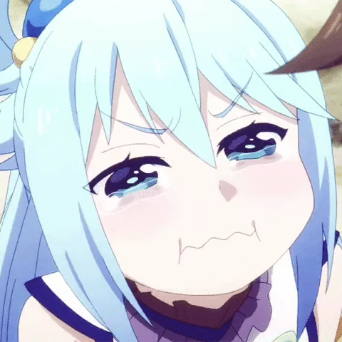

<picture><source media="(prefers-color-scheme: dark)" srcset="https://github.com/ctquang/ctquang/raw/main/assets/info-dark.svg" /></picture>

<picture><source media="(prefers-color-scheme: dark)" srcset="https://github.com/ctquang/ctquang/raw/main/assets/banner-dark.svg" /></picture>

## CONTACT ME

𝙵𝚎𝚎𝚕 𝚏𝚛𝚎𝚎 𝚝𝚘 𝚛𝚎𝚊𝚌𝚑 𝚘𝚞𝚝 ૮๑•̀ㅁ•́ฅა 
𝙹𝚞𝚜𝚝 𝚙𝚘𝚔𝚎 𝚖𝚎 𝚊𝚐𝚊𝚒𝚗 𝚒𝚏 𝙸 𝚏𝚘𝚛𝚐𝚎𝚝 𝚝𝚘 𝚛𝚎𝚙𝚕𝚢 ( ´ㅁ&#96; ; )  
❀˚✿˖°❀˖°✿˖❀˖°  

